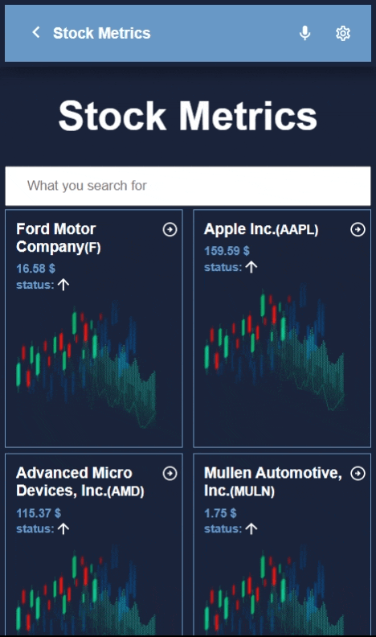

# Stock Metrics




> Stock Metrics is a web(mobile-focused) software for monitoring the stock exchange's listed firms and seeing their live metrics. It uses data from the Financial Modeling API. 

- [Live Demo](https://test.app/)


## Built With

- Frameworks / Libraries
  ```bash
  - React 
  - Redux
  - React Testing Library
  - Jest
  - Git
  - Linters
  ```


## Getting Started

To get a local copy up and running follow these simple example steps.

### Install
  -  [Git](https://git-scm.com/downloads)
  -  [Node](https://nodejs.org/en/download/)

### Usage
#### Clone this repository

```bash
$ git clone https://github.com/omarsalem7/Financial-metrices.git
$ cd Financial-metrices
```
#### Run project

```bash
$ npm install
$ npm start
```

## Authors

👤 **Omar Salem**


[<code></code>](https://github.com/omarsalem7)
[<code></code>](https://twitter.com/ShaherShamroukh/)
[<code></code>](https://www.linkedin.com/in/omar-salem-a6945b177/)
 <a href="mailto:omarsalem0721@gmail.com?subject=Hey Omar!"></a>
 
<br/>
## 🤝 Contributing

Contributions, issues, and feature requests are welcome!

Feel free to check the [issues page](../../issues/).


## Acknowledgement
Original design idea by [Nelson Sakwa on Behance..](https://www.behance.net/gallery/31579789/Ballhead-App-%28Free-PSDs%29) Under the [Creative Commons License](https://creativecommons.org/licenses/by-nc/4.0/)

## Show your support

Give a ⭐️ if you like this project!
